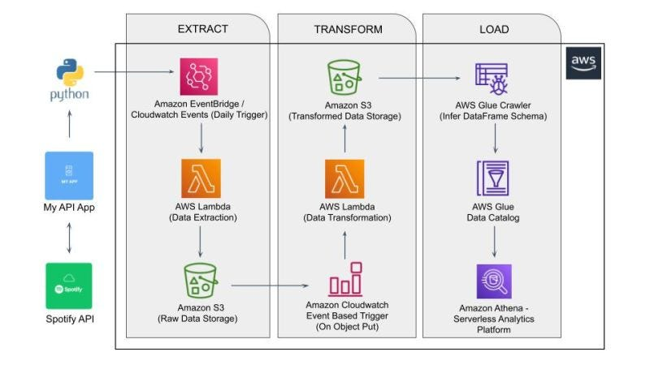

# Spotify AWS End to End ETL Data Pipeline Project

## Introduction:

In this project, we will build an ETL (Extract, Transform, Load) pipeline using the Spotify API on AWS. The pipeline will retrieve data from the Spotify API, transform it to a desired format, and load it into an AWS data store.

## Implementation:

Implement Complete Data Pipeline Data Engineering Project using Spotify

* Integrating with Spotify API and extracting Data
* Deploying code on AWS Lambda for Data Extraction
* Adding trigger to run the extraction automatically 
* Writing transformation function
* Building automated trigger on transformation function 
* Store files on S3 properly
* Building Analytics Tables on data files using Glue and Athena


### Spotify AWS Data Pipeline Architecture Diagram:



### Dataset/API:

This project used [Spotify API](https://developer.spotify.com/documentation/web-api)

Accessed Spotify api using [Spotipy](https://spotipy.readthedocs.io/en/2.22.1/) Spotipy is a lightweight Python library for the Spotify Web API.

1. Spotify: https://developer.spotify.com/documentation/web-api
2. Spotipy: https://spotipy.readthedocs.io/en/2.22.1/

### Tools used: Python, AWS services (CloudWatch, Lambda, S3, Glue and Athena)

This is a brief overview of what each service does:

1. **S3 (Simple Storage Service):** Easily store and retrieve large amounts of data. Each file is called an object and data is stored in buckets.

2. **Lambda:** Serverless compute service to run code without managing servers. We will use Lambda to deploy the Python code to perform data extraction and transformation.

3. **CloudWatch:** Monitor and collect metrics from AWS resources. Can be used to monitor log files and set alarms.

4. **EventBridge:** Create and manage events, schedule them based on a defined pattern or cron expression.

5. **Crawler:** Component of AWS Glue that automatically scans and analyzes data sources to infer their schema and create metadata tables.

6. **Glue Data Catalog:** Fully managed metadata repository provided by AWS Glue. It acts as a central repository for storing and organizing metadata information about various data sources, including tables, schemas, and partitions. You can use the Glue Data Catalog without the Crawler if you already have the metadata information or prefer to define and manage the metadata manually and can directly create and populate tables in the Glue Data Catalog.

7. **Athena:** Interactive query service to analyze data stored in various sources using standard SQL queries. You can query data from the Glue Data Catalog, S3 and other supported data sources.

This project can also be implemented using services from other cloud providers such as Google Cloud Platform (GCP) and Azure. The architecture diagrams for these 2 platforms are also included in the course.

### Packages:

```
pip install pandas
pip install numpy
pip install spotipy
```